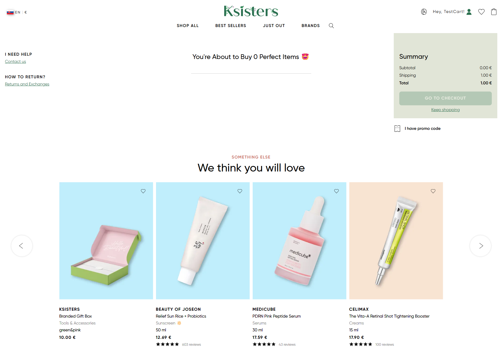
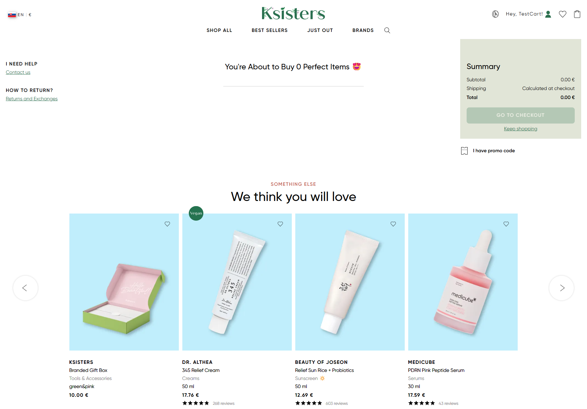

## Title
Cart - Shipping and total are not updated after removing last item from cart

## Description
When the user removes the last item from the cart, the cart summary in not updated correctly.
The cart still displays a shipping cost of `1.00 €` and a total of `1.00 €`, even though the cart is empty.
After refreshing the page, the cart summary is updated corryctly, which indicates that issue is related to UI state not being refreshed.

## Steps to Reproduce
1. Open https://ksisters.sk/
2. Add any product to the cart
3. Open the cart
4. Remove the product from the cart
5. Observe the cart summary

## Expected Result
When the cart becomes empty:
* shipping cost should be `0.00 €` or `Calculated at checkout`
* total amount should be `0.00 €`
* the cart summary should update immediately

## Actual Result
* The cart contains 0 items
* Shipping is still shown as `1.00 €`
* Total is `1.00 €`
* Checkout is not completed
* After refreshing the page, the cart summary is updated correctly:
    * Shipping: `Calculated at checkout`
  * Total: `0.00 €`

## Environment
* URL: https://ksisters.sk/
* OS: Windows 11
* Browser: Google Chrome (latest version)
* Device: Desktop

## Attachments
### Cart summary before refresh (incorrect state)

### Cart summary after refresh (correct state)

### Video reproduction
[Watch video](../assets/recordings/cart-summary-not-updated-after-removal.mp4)

## Severity / Priority
Severity: Medium
Priority: Medium
