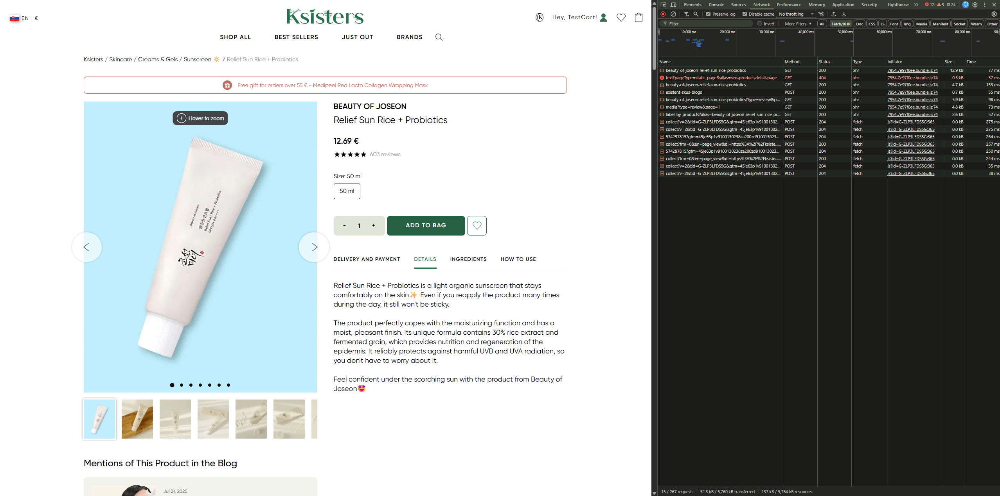
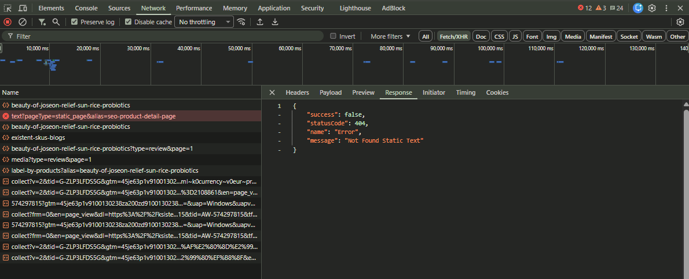

## Title
Product page - Request for `seo-product-detail-page` static text returns 404

## Description
When the user opens a product page, the application sends a request for static text with the alias `seo-product-detail-page`.
This request returns a `404 Not Found` response, which indicates that the required static text resource is missing or unavailable.
The issue occurs during a normal user flow and can be observed in the Network tab in DevTools.

## Steps to Reproduce
1. Open https://ksisters.sk/
2. Open DevTools -> Network
3. Enable "Preserve log" (optional)
4. Open any product page
5. Observe the request: `/en/api/website/static/text?pageType=static_page&alias=seo-product-detail-page`

## Expected Result
The product page should load all required resources successfully without `404 Not Found` errors.

## Actual Result
* The request for static text returns `404 Not Found`
* Response: 
```json
{
  "success": false,
  "statusCode": 404,
  "name": "Error",
  "message": "Not Found Static Text"
}
```

## Environment
* URL: https://ksisters.sk/
* OS: Windows 11
* Browser: Google Chrome (latest version)
* Device: Desktop

## Attachments
### 404 status in DevTools


### 404 response in DevTools


## Severity / Priority
Severity: Medium
Priority: Medium