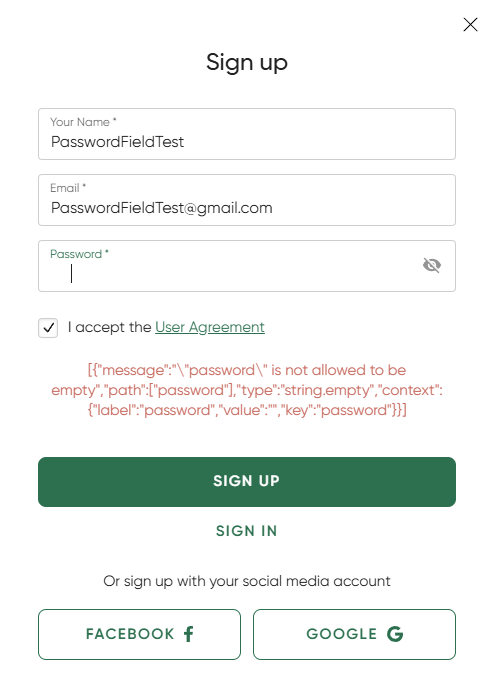

## Title
Registration - Raw validation error is displayed for invalid password input - Sign up form

## Description
The sign up form correctly rejects a password that contains only spaces.
However, instead of showing a clear and user-friendly validation message, the UI displays a raw backend error response in `JSON` format.
This makes the error difficult to understand for the user and exposes technical details in the interface.

## Steps to Reproduce
1. Open https://ksisters.sk/
2. Open the `Sign up` form
3. Enter a valid name
4. Enter a valid email
5. Enter a password with only spaces (e.g. " ")
6. Accept the User Agreement
7. Click `Sign up`

## Expected Result
The form should show a clear and user-friendly validation message, such as: `Password cannot be empty.`

## Actual Result
* The request is rejected with a validation error
* The UI displays a raw backend error response in `JSON`-like format
* The message is not user-friendly and is difficult to read

## Environment
* URL: https://ksisters.sk/
* OS: Windows 11
* Browser: Google Chrome (latest version)
* Device: Desktop

## Attachments
### Raw validation error shown in the UI

## Severity / Priority
Severity: Medium
Priority: Medium