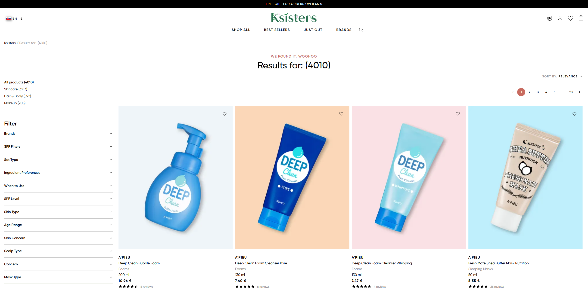

## Title
Search - Empty query can be submitted via Enter key (bypasses UI validation) - Search page

## Description
The search input does not allow submission through UI when the field is empty (no search button is shown).
However, the user can still submit an empty query by pressing the Enter key.
This creates inconsistent behavior between UI and keyboard interaction.
This issue happens on desktop, but not on mobile devices.

## Steps to Reproduce
1. Open https://ksisters.sk/
2. Click on the search icon
3. Leave the input field empty
4. Press `Enter`

## Expected Result
Search should not be triggered when the input is empty, no matter how the user submits it.

## Actual Result
* Search is triggered when pressing `Enter`
* Displays: `Results for: (4010)`

## Environment
* URL: https://ksisters.sk/
* OS: Windows 11
* Browser: Google Chrome (latest version)
* Device: Desktop

## Attachments
### Empty input (no search button)

### Result after pressing Enter

### Input with text (search button appears)

## Severity / Priority
Severity: Medium
Priority: Medium