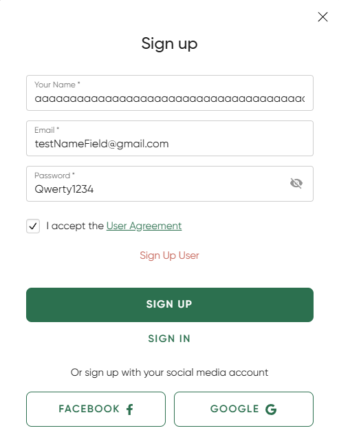
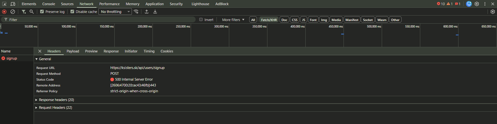
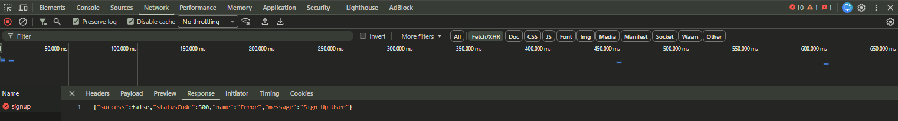

## Title
Registration - Name input longer than 100 characters causes 500 Internal Server Error - Sing up form

## Description
The sign up form accepts a name with up to 100 characters, but when the input length becomes 101 characters, the server returns a `500 Internal Server Error`.
This indicates that the system does not properly validate or handle the maximum allowed length for the `Name` field on the backend.
There is no visible validation or guidance for the maximum allowed length of the Name field in the UI, which may lead users to enter values that cause the system to fail.
The issue can be observed in the Network tab in DevTools.

## Steps to Reproduce
1. Open https://ksisters.sk/
2. Open the sign up form
3. Enter a very long value in the Name field (101+ characters)
4. Enter a valid email (e.g. testNameField@gmail.com)
5. Enter a valid password (e.g. Qwerty1234)
6. Accept the User Agreement
7. Click `Sing Up`

## Expected Result
The system should validate input length and show a clear validation error, or reject the request with a proper response (e.g. 400/422), without crashing.
The UI should provide clear guidance or constraints for the input length.

## Actual Result
* Name with 100 characters is accepted
* Name with 101 characters causes 500 Internal Server Error
* Response `{"success":false,"statusCode":500,"name":"Error","message":"Sign Up User"}`

## Environment
* URL: https://ksisters.sk/
* OS: Windows 11
* Browser: Google Chrome (latest version)
* Device: Desktop

## Attachments
### Input with 101+ characters in Name field

### Server response (500 Internal Server Error)

### Error response in DevTools

## Severity / Priority
Severity: High
Priority: Medium